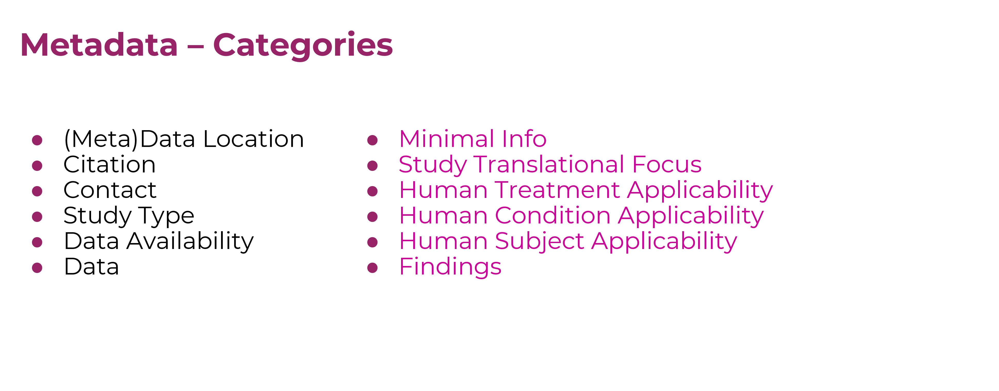

# HEAL Study-level Core Metadata

- Explore the HEAL Study-level Core Metadata fields as [PDF](study-level-metadata-fields/study-metadata-schema-for-humans.pdf) or [markdown](study-level-metadata-fields/study-metadata-schema-for-humans.md)  
- Learn more about the HEAL Platform study registration and metadata fulfillment process, including 
  - an [overview](./study-registration-and-metadata-fulfillment-process/part-1-0-overview-of-process.pdf) 
  - what investigators can get started on [right away](./study-registration-and-metadata-fulfillment-process/part-2-0-questions-to-ask-yourself-now.pdf)
  - detailed [how-to guides](#study-registration-and-metadata-fulfillment-process)

Continue [below](#heal-initiative-purpose) for a quick overview of and context for the what, why, and how of HEAL Study-level Metadata
  
For a more in-depth overview and background, head over to watch the HEAL Stewards-hosted [Metadata 102 Webinar](https://www.youtube.com/watch?v=RY1_N0-QENY).

## HEAL Initiative Purpose
The HEAL initiative purpose is to stimulate and draw together a vast array of knowledge being generated from HEAL funded research and practice activities spanning
1. fields of opioid and pain research, and 
2. stages and types of research from pre-clinical to clinical, epidemiology, industry, community, and policy 

with the goal of fostering collaboration and breaking down siloes between the study of human pain and opioid conditions, **and** between researchers, practitioners, and communities impacted by the pain and opioid crises  

 

Importantly, the HEAL initiative purpose in this is specifically translational; to drive, and involve and inform a broad community about, solutions to the human conditions of OUD and Pain.  

## Study-level Metadata to Drive HEAL Initiative Purpose

The HEAL Platform will provide the main gateway and interface for this collaboration and cross-pollination in solution-finding; 

HEAL initiative metadata is metadata that the HEAL Platform can use to power search and discovery tools that let the heal initiative audience achieve the heal initiative purpose  

Metadata provided by HEAL investigators power search and discovery tools on the HEAL Platform, and allow members of the HEAL audience to intuitively find what they are looking for on the HEAL Platform.

The utility of dataset and variable level metadata, especially for detailed harmonization of datasets is powerful. Study level metadata serves a different and essential purpose – Regardless of whether I'm a data-savvy researcher, patient, clinician, economist, or policy-maker, whether I come from a focus on pain or opioid conditions, how do I quickly and easily hone in on and discover studies that might be producing the datasets or findings that I care about, perhaps even before they produce or release any data?

## Study-level Metadata Fields

To that end we’ve developed the HEAL Study-level core metadata fields, or model – with metadata elements grouped across 12 categories

There are about 85 total fields across the 12 categories. 

We expect that about 40% of these fields will be auto-populated using existing sources of metadata (see [below](#study-registration-and-metadata-fulfillment-process) for explanation of metadata auto-population/harvesting). This is likely to be higher for studies that are reportable clinical trials and registered at ClinicalTrials.gov. Nearly all fields that may require manual curation will be in the format of selection from a drop-down list of controlled vocabulary terms, or be required to conform to a MM/DD/YYYY date type format.  

Detailed description of fields: 

[Download PDF of Metadata Fields](study-level-metadata-fields/study-metadata-schema-for-humans.pdf)
 
[View markdown of Metadata Fields](study-level-metadata-fields/study-metadata-schema-for-humans.md)

## Study Registration and Metadata Fulfillment Process

We know that investigators already provide study metadata to other sources (e.g. the NIH during the award application process, to ClinicalTrials.gov during the study registration process if the study is a reportable clinical trial). During the study registration process, investigators will provide links to these sources of existing metadata. The Platform will harvest this metadata, and use as much as possible to fulfill the HEAL Study-level Core Metadata requirements. Investigators will only be asked to provide the balance of metadata that cannot be harvested from existing sources. 

Resources, including an overview of the study registration and metadata fulfillment process, and detailed how-to guides: 

- Part 1.0 - [Overview of Process](./study-registration-and-metadata-fulfillment-process/part-1-0-overview-of-process.pdf)
- Part 2.0 - [Questions to Ask Yourself Now](./study-registration-and-metadata-fulfillment-process/part-2-0-questions-to-ask-yourself-now.pdf)
  - Part 2.1 - [How to Find your Study 'Permalink'](./study-registration-and-metadata-fulfillment-process/part-2-1-how-to-find-your-study-permalink.pdf)
- Part 3.0 - [How to Register your Study on the HEAL Platform (Pre-launch)](./study-registration-and-metadata-fulfillment-process/part-3-0-how-to-register-your-study-on-the-heal-platform-pre-launch.pdf)
  - Part 3.1 - [How to Find Your CEDAR User Account UUID](./study-registration-and-metadata-fulfillment-process/part-3-1-how-to-find-your-cedar-user-account-uuid.pdf)
  - Part 3.2 - [How to Find Your HEAL Platform-created CEDAR Template Instance](./study-registration-and-metadata-fulfillment-process/part-3-2-how-to-find-your-heal-platform-created-cedar-template-instance.pdf)
  - Part 3.3 - [How to Provide Supplemental Metadata in Your HEAL Platform-created CEDAR Template Instance](./study-registration-and-metadata-fulfillment-process/part-3-3-how-to-provide-supplemental-metadata-in-your-heal-platform-created-cedar-template-instance.pdf)