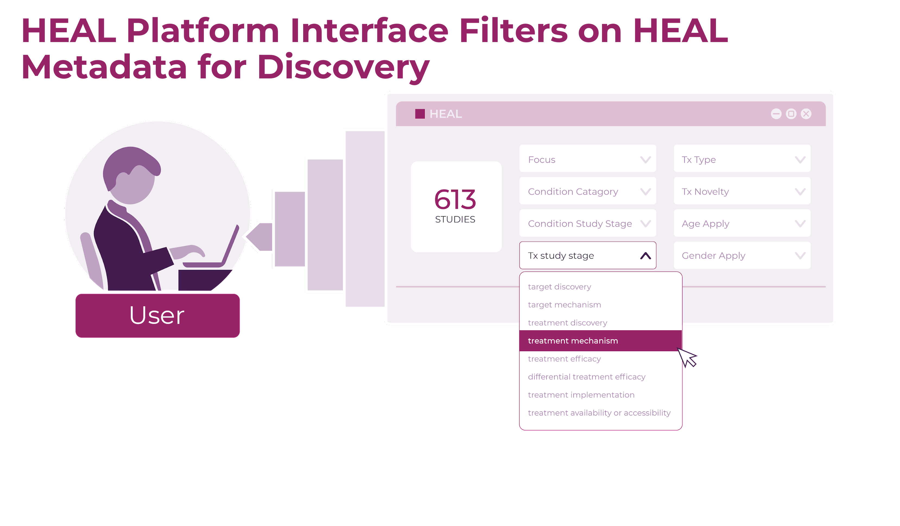

# HEAL Study-level Core Metadata

- Explore the HEAL Study-level Core Metadata fields as [PDF](study-level-metadata-fields/study-metadata-schema-for-humans.pdf) or [markdown](study-level-metadata-fields/study-metadata-schema-for-humans.md)  
- Learn more about 
  - the HEAL Platform Study registration process, 
  - how the Platform uses study registration to minimize HEAL investigator effort to fulfill the metadata requirements, and 
  - what investigators can get started on right away

Continue below for a quick overview of the what, why, and how of HEAL Study-level Metadata
  
For a more in-depth overview, head over to watch the HEAL Stewards-hosted [Metadata 102 Webinar](https://www.youtube.com/watch?v=RY1_N0-QENY).

## HEAL Initiative Purpose
The HEAL initiative purpose is to stimulate and draw together a vast array of knowledge being generated from HEAL funded research and practice activities spanning
1. fields of opioid and pain research, and 
2. stages and types of research from pre-clinical to clinical, epidemiology, industry, community, and policy 

with the goal of fostering collaboration and breaking down siloes between the study of human pain and opioid conditions, **and** between researchers, practitioners, and communities impacted by the pain and opioid crises  

 

Importantly, the HEAL initiative purpose in this is specifically translational; to drive, and involve and inform a broad community about, solutions to the human conditions of OUD and Pain.  

## Study-level Metadata to Drive HEAL Initiative Purpose

The HEAL Platform will provide the main gateway and interface for this collaboration and cross-pollination in solution-finding; 

HEAL initiative metadata is metadata that the HEAL Platform can use to power search and discovery tools that let the heal initiative audience achieve the heal initiative purpose  

Metadata provided by HEAL investigators power search and discovery tools on the HEAL Platform, and allow members of the HEAL audience to intuitively find what they are looking for on the HEAL Platform.

The utility of dataset and variable level metadata, especially for detailed harmonization of datasets is powerful. Study level metadata serves a different and essential purpose – how do I quickly and easily hone in on and discover studies that might be producing the datasets or findings that I care about, perhaps even before they produce or release any data?

## Study-level Metadata Fields
[Download PDF of Metadata Fields](study-level-metadata-fields/study-metadata-schema-for-humans.pdf)
 
[View markdown of Metadata Fields](study-level-metadata-fields/study-metadata-schema-for-humans.md)

## Study Registration and Metadata Fulfillment Process