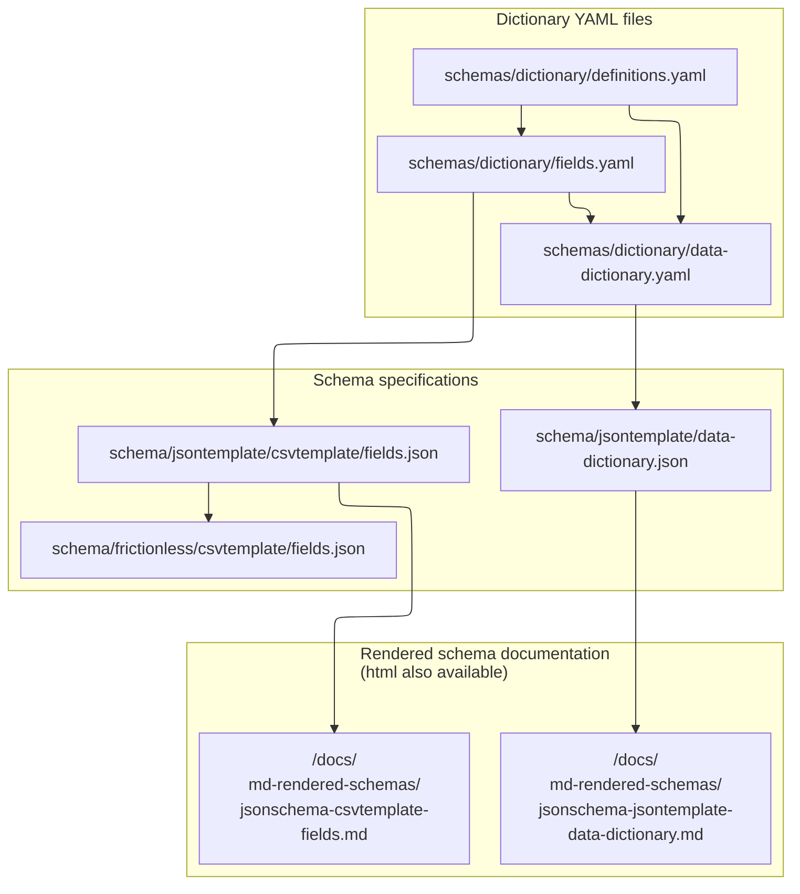

# Variable level metadata

This metadata directory contains the specifications for variable level metadata documents in the HEAL data ecosystem. 

## Schemas

❗ Look here for schema specifications.

### json data dictionary format specification
1. `schemas/jsonschema/data-dictionary.json`: The "json" json data dictionary schema (ie json template schema)
    - Intended to specify the data dictionary representation of json objects available in the HEAL platform metadata-service.
    - See here for the markdown rendered version --> [`docs/md-rendered-schemas/jsonschema-jsontemplate-data-dictionary.md`](docs/md-rendered-schemas/jsonschema-jsontemplate-data-dictionary.md)

### csv field format specifications
- See here for the markdown rendered version --> [`docs/md-rendered-schemas/jsonschema-jsontemplate-data-dictionary.md`](docs/md-rendered-schemas/jsonschema-csvtemplate-fields.md)


2. `schemas/frictionless/fields.json` Table schema (previously known as "frictionless") standard specification
    - This json file is intended to represent csv data dictionary documents following the [Table Schema specification](https://specs.frictionlessdata.io/table-schema/).
    - Csv version is intended to make data dictionary creation and discovery available in a more familiar/human readable format,
    - The representation of data dictionary field values in a csv file. It's used to facilitate documentation of data dictionary csv 
    files in addition to input validation. 
3. `schemas/jsontemplate/fields.json`The "csv" json schema (ie csv template schema)
    - :warning: The "csv" json schema is intended to be an intermediate specification used for documentation and in translation workflows to the json schema template. As fully specifying a tabular file (for example missing value specification) is out of scope here (see the table schema representation in (2))

## Document flow chart



## Directories

- `docs`: 
See the rendered human readable schemas
in a markdown format and an interactive html format.
- `schemas/jsonschema`: contains the final and full specification for schemas following json schema.
- `schemas/frictionless`: contains schemas following the frictionless table schema specifications. See [here](https://specs.frictionlessdata.io/table-schema/) for the specification. 
- `schemas/dictionary`: the yaml files used to generate json schemas and documentation with build.py. 
- `templates`: empty templates in csv spreadsheet format and JSON format. 
- `examples`: exapmles of filled out templates in csv spreadsheet format and JSON format.
- `build.py`: This script compiles the yaml files and generates associated jsonschemas and frictionless schemas in addition to the human rendered schemas

## Contributing

To contribute to the variable level metadata specification (and annotations/examples/documentation), please modify the `dictionary/*.yaml` files directly.

1. Update the dictionary/*.yaml files
2. Run `build.py` script
3. Check output is correct (see above)
4. When satisfied, push to github and ensure it passes validation (ie commit has ✔️ and not ❌)

❗ Please read the below conventions and principles before contributing and review the existing `dictionary` directory.


## Conventions, principles, and rules

### Annotation/documentation properties
1. `description`: SHOULD be created as markdown syntax without any headers as headers are applied in the templates.

2. `additionalDescription`: SHOULD be added if there are additional documentation "footer" details. In rendering the documentation, these are appended to the end of rendered markdown document.

### `type` conversion rules 
Given csv field values can only be scalar values with records separated by a new line and each individual field values separated by a comma delimiter, the following rules and restrictions are applied to allow json to csv specification translation.

1. type `object`
    - converted to type `string` with pattern of `^(?:.*?=.*?(?:\||$))+$` to indicate a stringified object with a equal sign (`=`) connecting the key-value pair and a pipe (`|`) delimiter separating unique key-value pairs.
2. type `array`
    - if type `object` in `items`: flattened to the children property or properties
    - if type is a scalar (`string`,`integer`,`number`) in `items`,
     translated to type `string` with pattern `^(?:[^|]+\||[^|]*)(?:[^|]*\|)*[^|]*$` to indicate a string containing a pipe delimiter (i.e., a stringified array with a pipe delimiter)
### `property` name conversion rules 
To facilitate the mapping of json spec property names to csv property names,  the resulting flattened `property` names from the flattened properties should correspond to the [jsonpath](https://datatracker.ietf.org/doc/id/draft-goessner-dispatch-jsonpath-00.html) representation where:

1. type `object`

    The json spec type object property below:
    ```json

    "constraints": {
            "type": "object",
            "properties": {
                "maxLength": {
                    "type": "integer"}
        }
    }
    ```

    translates to the csv stringified type object:

    ```json

    "constraints.maxLength":{"type":"integer"}

    ```
2. type `array`

    The json spec type array property below: 

    ```json
    { "..more props..":"...",
    "standardsMappings": {
    "type": "array",
    "items": {
    "type": "object",
    "properties": {
        "instrument": {
            "type": "object",
            "properties": {
                "url": {
                    "type": "string",
                    "format": "uri"
                },
                "..more props..":"..."}
        },
        "..more props..":"..."}
    }}}

    ```
    translates to the csv stringified type array property:
    
    ```json
        { "..more props..":"...",
        "standardsMappings[0].instrument.url": {
                "type": "string",
                "format": "uri"
            }
        }
    ```

### Complex `type` restrictions 

1. Currently, no complex types (`anyOf`,`oneOf`) are supported and the `type` MUST be specified. This is to ensure coverage for all csv to json translation use cases.
    - Each json specification schema property type must be a scalar (e.g., `boolean`,`string`,`integer`,`number`), an `array`, or an `object`
    - Each csv specification schema property type must be a scalar (e.g., `boolean`,`string`,`integer`,`number`)
2. `enum` restrictions
    - following from (1), an `enum` must only contain values of the same type
    - (at least currently) MUST contain only types supported by csv fields which include scalar types (e.g., `boolean`,`string`,`integer`,`number`) in addition to type `object` as this has a stringified representation (see above).

### csv to json and json to csv translations

There are two rules for conversion from json to csv (or csv to json) specs:

1. __csv spec field-level property and json spec root-level property match__: If  -- in the json schema spec version --  a property is specified at the root-level AND this same property is specified in the field level of the json spec schema
    - csv to json: If the same value/instance of a property exists at the field level for ALL records (only one unique value but no missing values) then this unique value -- when translated to the json spec version -- will be moved to the root level data dictionary
    - json to csv: All root level properties will be moved to individual field properties BUT field level properties that exist take precedence.

More concretely, this provides a way to specify root level properties within vlmd csv documents for a few use cases but can generalize to other future additional property matches:

1. specifying the schema version that represents the vlmd document (`schemaVersion`)
2. specifying other data dictionary level properties such as `standardsMappings[0].instrument`

### root ("data dictionary level") and field property cascading pattern
Akin to the above json to csv, more generally:

All root level properties will be applied to individual fields IF this same field level property is not specified (i.e., field-level takes precedence). This strategy can be seen in the [data package standard (but with missingValues)](https://specs.frictionlessdata.io/patterns/#missing-values-per-field)


### csv and json vlmd document file naming

File names for json and csv translations of a vlmd document SHOULD
have the same stem name with corresponding "csv" and "json" suffixes (eg `my-heal-dd.csv` and `my-heal-dd.json`)

## Considerations

Please use github issues for any additional considerations. See additional comments above.


## Additional table-level (root) and field-level properties

Some table-level or field-level properties in other standards (or custom properties in specific use cases) do not map onto 
a core HEAL property. To allow these properties to be included, we list these property names under `propertyNames`.

 ❗ For study or use case specific names, it is recommended to put the property under a `custom` namespace (e.g., `"custom":{"myvarname"})`. Adding additional properties here are for well established standards and/or property names used in practice.

 ☝️ The use of [`propertyNames`](https://json-schema.org/draft-07/json-schema-validation#rfc.section.6.5.8) was used to:
 
 1. allow inclusion and minimal validation of these extra properties (ie of only the existence of property names) without making any assumptions about corresponding property types. 
 2. It also provides a clear distinction between "core" properties and "extra" properties.

 One consideration, however, is that `propertyNames` was introduced in json schema draft-6.

